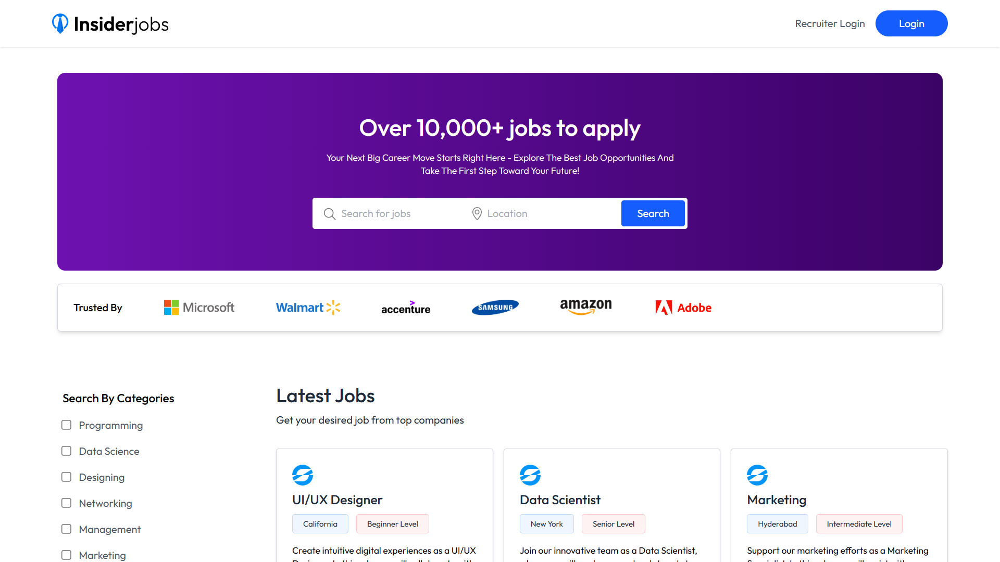
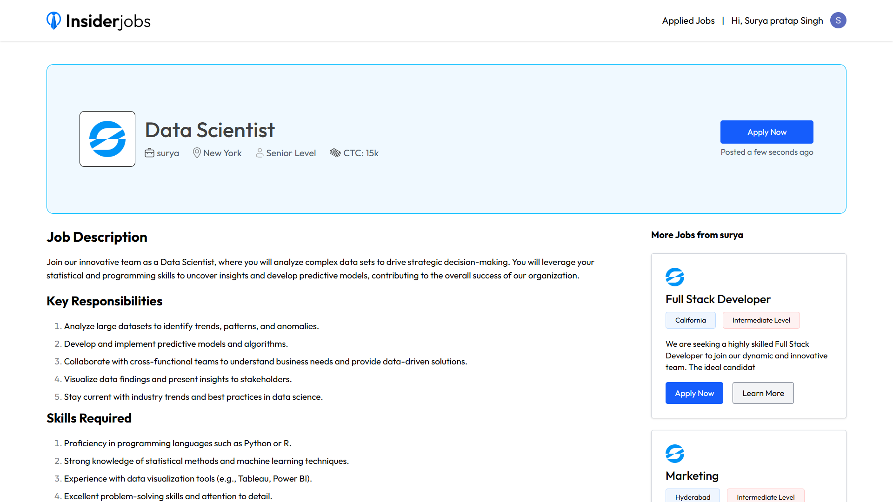
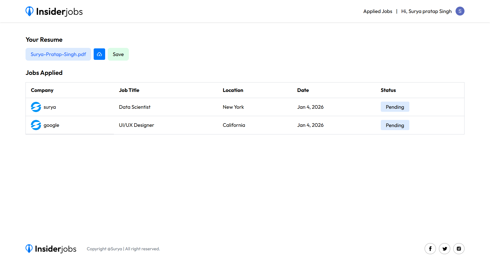
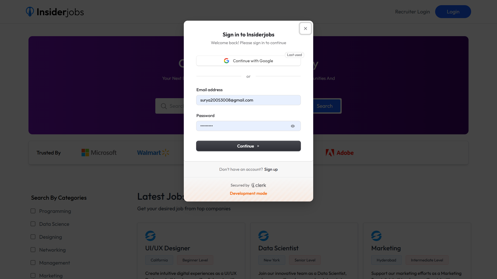
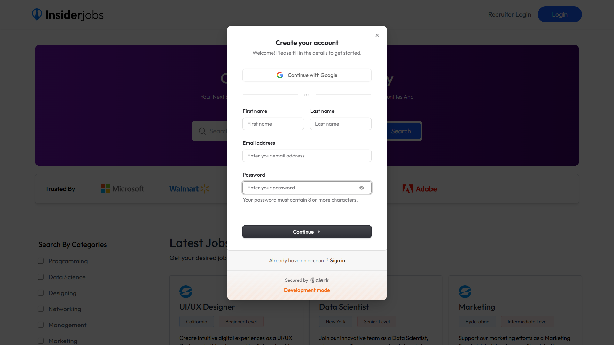
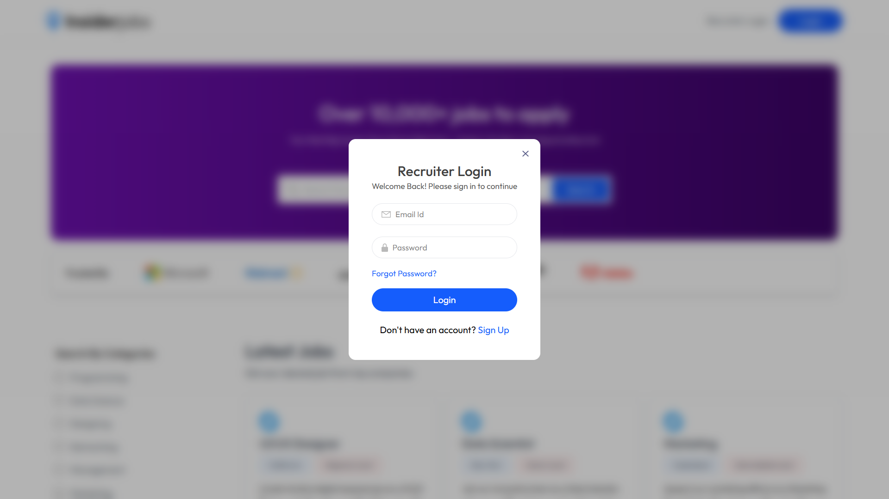
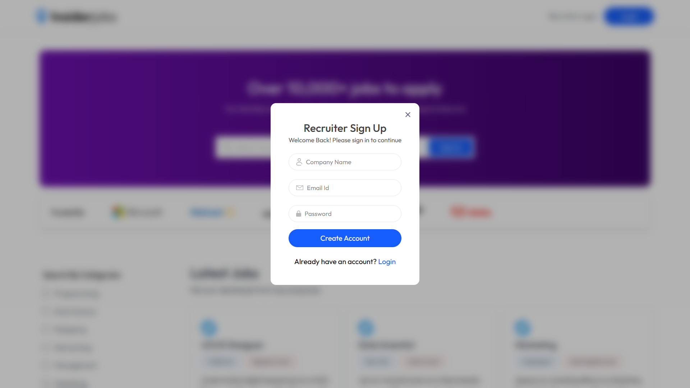
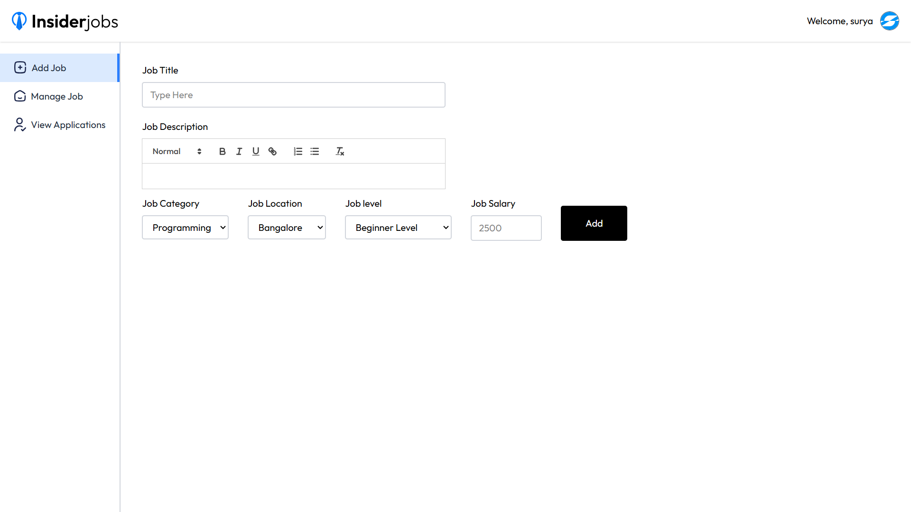
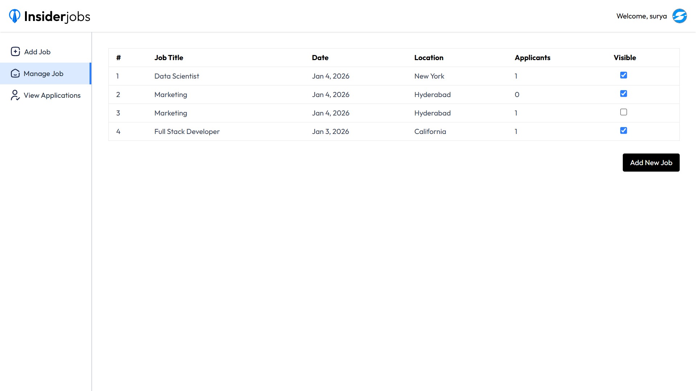
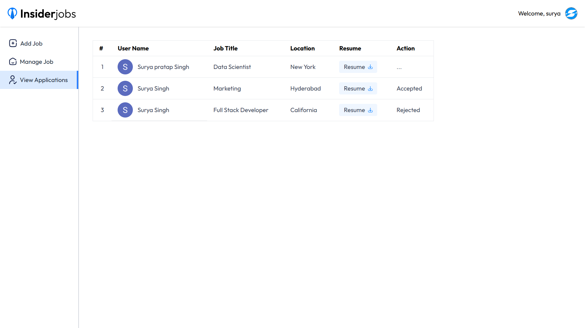

<div id="top"></div>

<div align="center">

# 💼 INSIDERJOBS
*A Full-Stack MERN Job Portal Web Application*


**Tech Stack Used**


</div>

---

## 📸 Screenshots

### 🖥️ Desktop View

| Home | Job Details | Applied Jobs |
|:--:|:--:|:--:|
|  |  |  |

---

### 👤 Candidate Authentication

| Login | Register |
|:--:|:--:|
|  |  |

---

### 🧑‍💼 Recruiter Authentication

| Login | Register |
|:--:|:--:|
|  |  |

---

### 🧑‍💼 Recruiter Dashboard

| Add Job | Manage Jobs | View Applications |
|:--:|:--:|:--:|
|  |  |  |

---

## 📑 Table of Contents

- [Overview](#-overview)
- [Features](#-features)
- [User Roles](#-user-roles)
- [Tech Stack](#-tech-stack)
- [Project Structure](#-project-structure)
- [Getting Started](#-getting-started)
- [Usage](#-usage)
- [Future Enhancements](#-future-enhancements)
- [Contact](#-contact)

---

## 🧐 Overview

**Insiderjobs** is a **full-stack Job Portal Web Application** built using the **MERN stack**.  
It provides a complete recruitment workflow with **role-based access** for **Candidates** and **Recruiters**.

- Recruiters can **post, manage, hide/show jobs**, and **review applications**
- Candidates can **browse jobs, apply with resumes**, and **track application status**
- Secure authentication, resume uploads, dashboards, and real-time UI feedback are fully implemented

---

## ✨ Features

### 👨‍🎓 Candidate Features
✅ Browse jobs with **category & location filters**  
✅ Job listing **pagination**  
✅ View detailed job descriptions  
✅ Apply to jobs (login required)  
✅ Upload & save resume (PDF)  
✅ Track applied jobs with status:
- Pending  
- Accepted  
- Rejected  

---

### 🧑‍💼 Recruiter Features
✅ Recruiter authentication (custom auth)  
✅ Add new job postings  
✅ Rich job descriptions using **Quill Editor**  
✅ Manage jobs (Visible / Hidden)  
✅ View all job applications  
✅ Download candidate resumes  
✅ Accept / Reject candidates  

---

### 🔔 General Features
✅ Toast notifications for all actions  
✅ Role-based route protection  
✅ Responsive UI  
✅ Cloudinary file uploads  
✅ Clean dashboard UI  

---

## 👥 User Roles

### 🔹 Candidate
- Authentication via **Clerk**
- Resume upload & job application
- Application status tracking

### 🔹 Recruiter
- Custom authentication (Email + Password)
- Company registration with logo
- Job & application management dashboard

---

## ⚙️ Tech Stack

### **Frontend**
- React.js
- React Router
- Context API
- Axios
- React Toastify
- Quill Editor

### **Backend**
- Node.js
- Express.js
- MongoDB & Mongoose
- JWT Authentication
- Multer (File Uploads)

### **Cloud Services**
- Cloudinary (Images & PDF resumes)
- Clerk (Candidate Authentication)

### **Deployment**
- Vercel (Frontend)
- Backend deployable on Render / Railway

---

## 📂 Project Structure

```bash
Insiderjobs/
├── client/                    # Frontend (React)
│   ├── public/
│   └── src/
│       ├── assets/
│       ├── components/
│       ├── pages/
│       ├── context/
│       ├── App.jsx
│       └── main.jsx
│
├── server/                    # Backend (Node + Express)
│   ├── config/
│   ├── controllers/
│   ├── models/
│   ├── routes/
│   ├── middlewares/
│   ├── utils/
│   └── server.js
│
└── README.md
```

## 🚀 Getting Started

### ✅ Prerequisites
- Node.js & npm
- MongoDB (Local or Atlas)
- Cloudinary account
- Clerk account

### 👇 Installation

```bash
# Clone the repository
git clone https://github.com/Surya821/Insiderjobs

# Navigate to project
cd Insiderjobs
```

### 🔧 Setup Client

``` bash
cd client
npm install
npm run dev
```

### 🖥️ Setup Server

``` bash
cd server
npm install
npm run dev
```

---

### 🔑 Environment Variables
Create a .env file in client/:
```bash
VITE_CLERK_PUBLISHABLE_KEY=your_vite_clerk_publishable_key
VITE_BACKEND_URL=your_backend_url
```

### 🔑 Environment Variables
Create a .env file in server/:
```bash
MONGO_URI=your_mongodb_url
JWT_SECRET=your_secret_key
CLOUDINARY_NAME=your_cloud_name
CLOUDINARY_API_KEY=your_api_key
CLOUDINARY_API_SECRET=your_api_secret
CLERK_PUBLISHABLE_KEY=your_clerk_publishabkle_key
CLERK_SECRET_KEY=your_clerk_secret_key
CLERK_WEBHOOK_SECRET=your_clerk_webhook_secret
```

---

## ▶️ Usage
1. **Open the app in browser**
2. **Browse jobs on homepage**
3. **Login as Candidate or Recruiter**
4. **Apply for jobs or manage postings**
5. **Track applications & update statuses**

---

## 🚧 Future Enhancements

- 🟦 Email notifications for application updates 
- 🟦 Saved jobs / bookmarks
- 🟦 Advanced search & sorting
- 🟦 Recruiter analytics dashboard
- 🟦 Chat between recruiter & candidate

---

## 📬 Contact

**Created by — Surya Pratap Singh**  
📩 **Contact Me:**  
[LinkedIn](https://www.linkedin.com/in/surya-pratap-singh1/) • [Gmail](mailto:surya30082005@gmail.com) surya30082005@gmail.com

If you like this project, consider giving it a ⭐ on GitHub!

<p align="right">(<a href="#top">⬆️ Back to Top</a>)</p>
